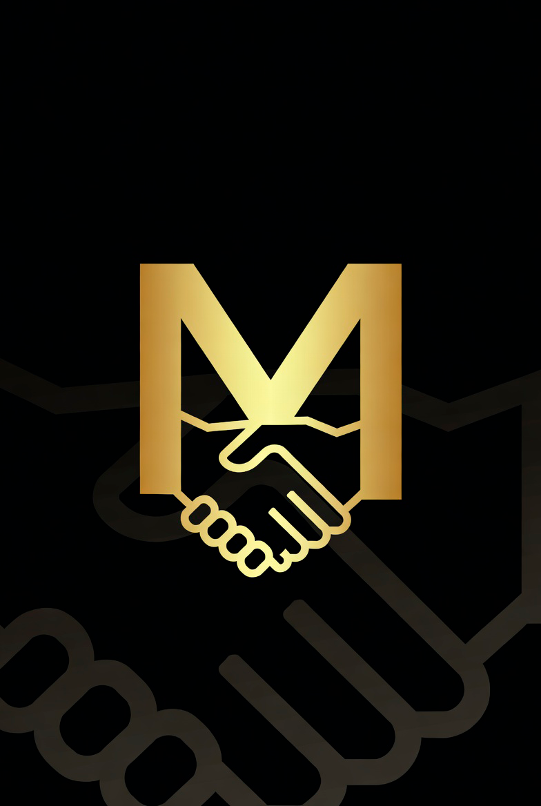

  

<h1 align="center">MONEY</h1>

<em>Proof of Swarm — Money. For Everyone. Forever.</em>

  
  
  
  
  

---

## What is MONEY?

MONEY is a decentralized digital currency where **every human gets the same amount** — validated by ordinary phones, not mining rigs, data centers, or banks.

**No pre-mine. No CEO. No investors. No mining.** One human, one equal share, verified by math — not by who showed up first or who owns the most hardware.

> *"The money of the future should belong to the people of the future."*

---

## Why it's different

Most "fair launch" coins aren't. Early insiders farm huge amounts before anyone else arrives, then call it fair. MONEY removes that entirely:

- 🎁 **Flat distribution** — every verified human receives the same allocation. Being early gives you no unfair advantage.
- 🧬 **Proof of personhood** — one human = one identity, proven with zero-knowledge (nothing stored, nothing revealed). No Sybil farming.
- ⛏️ **Not mined** — you can't earn more by owning more machines. The thing that makes other coins unfair simply doesn't exist here.
- 🧾 **Tamper-evident ledger** — the entire history is cryptographically sealed. Anyone can verify it's untouched without trusting the operator.

---

## What actually works today (honest status)

This is a solo project in active development. Here's the real state — nothing oversold:

| Component | Status |
|---|---|
| 🧾 Tamper-evident ledger (hash-linked + Merkle + verifiable tip) | ✅ built & independently audited |
| 🛂 Proof-of-personhood ignition gate (zk, nothing stored) | ✅ built & audited (mock mode) |
| 🏛️ Byzantine-fault-tolerant committee validation | ✅ built & audited (single-process) |
| ⚖️ Standing-based movement cap (anti-abuse) | ✅ built & audited |
| 🧪 Public testnet | ✅ live |
| 🌐 Real multi-node network (phones as validators) | 🔨 in progress |
| 🚀 Mainnet launch | ⏳ pending audit + regulatory review |

Every core component above was built, then **attacked by an independent adversarial auditor** before being accepted. This isn't a whitepaper promise — the code exists and survived being broken on purpose.

---

## How it works

### Proof of Swarm
Phones act as validator nodes. Transactions are confirmed by a committee of the swarm using Byzantine-fault-tolerant consensus — it stays correct even if some validators lie or go offline. No single point of failure, no gatekeeper.

### One human, one share
To claim your allocation you prove you're a unique human (zero-knowledge — no document or biometric is ever stored). That's the whole gate. No invite codes handed out by a founder, no "who you know."

### Faucet & decay
New humans claim an initial allocation. The base amount decays as the network grows, so the total supply self-regulates — but **everyone joining at the same stage gets exactly the same amount.** This is not mining: you cannot earn more by contributing more resources.

| Network size | Reward per human |
|---|---|
| 0 – 1M | 1,000,000 |
| 1M – 2M | 800,000 |
| 2M – 3M | 640,000 |
| 3M+ | −20% per additional million |

### Tamper-evident ledger
Every block is hash-linked to the last, with a Merkle root over its transactions and a single **tip hash** that fingerprints the entire history. Change anything, anywhere, ever → the tip changes → it's caught. Anyone can verify the whole chain without trusting anyone.

---

## Stack

| Layer | Tech |
|---|---|
| Mobile | React Native + Expo |
| Backend | Node.js + Express |
| Ledger | Hash-linked, Merkle-rooted, tamper-evident |
| Consensus | Proof of Swarm (BFT committee) |
| Identity | Zero-knowledge proof of personhood |
| Languages | TypeScript, JavaScript |

---

## Vision

MONEY is not a speculation vehicle. It's infrastructure for fairness.

The goal: a currency that works for a farmer in rural Africa, a student in Montréal-Nord, and a mechanic in Calgary — no bank account, no credit score, no powerful computer required. The phone in your pocket is enough.

---

## The person behind it

Built by **Luca Urbani** — an aircraft mechanic in Québec — solo, over four years, with no team, no VC, and no investors. Just a phone, a laptop, and a refusal to accept that money has to be unfair.

The philosophy behind the project is laid out in his book, *"Somewhere in the Milky Way"*:
📖 https://www.amazon.ca/Somewhere-Milky-Way-Luca-Urbani-ebook/dp/B0F73VCSG3

---

## Status

> Active development. Testnet is live. Core cryptographic foundations are built and independently audited. Real multi-node validation and mainnet launch are the next milestones. Contributions, forks, and honest criticism are all welcome — the goal is sound money existing in the world, by anyone, however it happens.

---

<em>Built by one person with a phone, a laptop, and a vision.</em>

